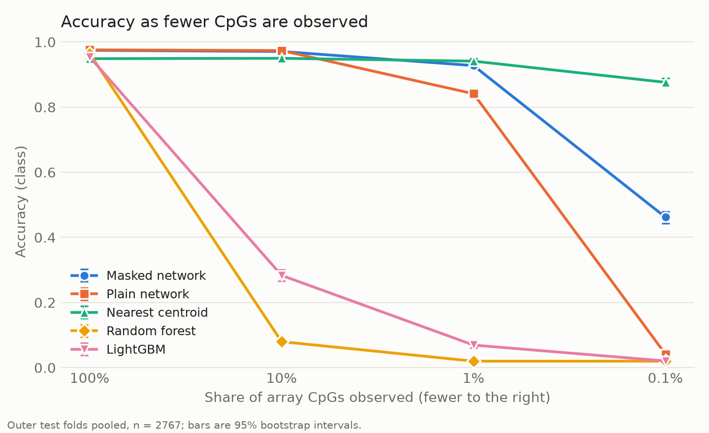
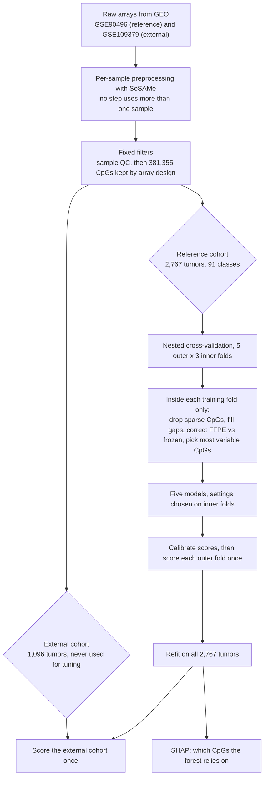
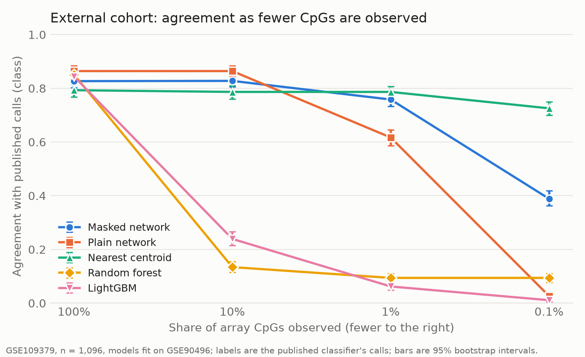

# Methylation-CNS-Tumor-Classifier

**How accurately can DNA methylation classify brain tumors, and how much of that
accuracy survives when only a small fraction of CpGs is measured, as in
low-coverage Nanopore sequencing during surgery?**

I trained five classifiers on 2,767 reference tumors in 91 methylation classes
(Capper et al., *Nature* 2018), fixed every target before modeling, and scored an
external cohort of 1,096 tumors exactly once.

| Question | Result | Target set in advance | Met? |
|---|---|---|---|
| Cross-validated classification | Family-level macro-F1 **0.987** (95% interval 0.979 to 0.993) | At least 0.90 | Yes |
| External cohort | Agreement with the published classifier, family-level macro-F1 **0.868** (0.820 to 0.908) | Within 5 points of cross-validation (0.993 on the same classes) | **No** |
| Calibration | Expected calibration error 0.346 before, **0.008** after; 0.026 on the external cohort | Below 0.05 | Yes |
| Sparse coverage, 1% of CpGs | Masked network **0.927** accuracy, random forest 0.020 | Network beats forest | Yes |

Three things I did not expect:

- **The external target was missed, and the model knew where.** Most disagreements
  fall in the 127 tumors the published classifier itself declined to call. On the
  969 it called confidently, agreement is 0.978.
- **A nearest-centroid baseline beat the neural network at very low coverage**
  (0.876 against 0.462 with 0.1% of CpGs). I added it after the first results and
  report it as such.
- **Validating against another classifier's calls is not validating against
  truth.** The external labels are the published model's own output, so I report
  agreement, not accuracy.



```bash
nextflow run pipeline/main.nf -profile quick    # TODO: confirm after the first full pipeline run
```

## How it works



**Data.** Two public Illumina 450K cohorts from Capper et al. (2018). The reference
cohort trains and cross-validates every model. The external cohort is 99% FFPE
tissue from routine diagnostics, against 67% in the reference cohort.

**Preprocessing.** SeSAMe processes each array on its own, so one tumor's values
never depend on another's and a new sample can be processed alone.

**Feature steps live inside the folds.** Anything computed from more than one
sample (which CpGs to keep, the values used to fill gaps, the FFPE correction,
which CpGs vary most) is learned on the training fold and applied unchanged to
the held-out fold. The test I used for every step: would this sample's result
change if other samples were added or removed? If yes, it belongs inside the fold.

**Models.**

| Model | CpGs used | Role |
|---|---|---|
| Random forest | 5,000 to 20,000 | Baseline in the style of the published classifier; the headline model |
| LightGBM | 5,000 or 10,000 | Gradient-boosted trees, tuned with Optuna |
| Plain network | 50,000 | Two hidden layers, trained on complete data |
| Masked network | 50,000 | Same network, trained with CpGs hidden at random |
| Nearest centroid | 50,000 | Distance to each class's mean profile, using observed CpGs only |

**Sparse coverage.** To imitate a low-coverage sequencing run, each test sample
keeps a random 100%, 10%, 1% or 0.1% of the array's CpGs. Every model sees the
same CpGs for the same sample.

**Rules to ensure best practices.**

- Targets were written down before any model was fit, and none was changed after
  results existed.
- Settings were chosen on inner folds only. Each outer test fold and the external
  cohort were scored once.
- Anything added after seeing results is labeled as added afterwards.

## Results

### Cross-validation on the reference cohort

Outer test folds pooled, 2,767 tumors, calibrated scores, 95% bootstrap intervals.

| Metric | Random forest, class | Random forest, family | LightGBM, class | LightGBM, family |
|---|---|---|---|---|
| Accuracy | 0.973 (0.967 to 0.979) | 0.993 (0.989 to 0.996) | 0.961 (0.953 to 0.967) | 0.983 (0.978 to 0.988) |
| Macro-F1 | 0.975 (0.967 to 0.982) | **0.987 (0.979 to 0.993)** | 0.952 (0.938 to 0.961) | 0.964 (0.951 to 0.974) |
| Expected calibration error | 0.008 | 0.006 | 0.015 | 0.007 |
| Share scoring 0.9 or higher | 0.920 | 0.972 | 0.908 | 0.954 |
| Accuracy among those | 0.993 | 0.998 | 0.986 | 0.996 |

"Family" groups closely related classes using the eight methylation class families
of Capper et al., giving 75 groups.

The forest misclassifies 2.7% of tumors at class level and 0.7% at family level.
The published classifier reported 4.28% and 1.14%. These are comparable, not
better: the published figures come from 3-fold cross-validation, and I removed 34
failed arrays at quality control.

### External cohort

The external labels are the published classifier's own calls (confirmed against
its Supplementary Table 4), so every figure below is **agreement with that
classifier**. The subsets were fixed before scoring.

| Subset | Tumors | Class agreement | Family agreement | Family macro-F1 |
|---|---|---|---|---|
| All (the pre-registered headline) | 1,096 | 0.870 | 0.931 | **0.868** (0.820 to 0.908) |
| Published score 0.9 or higher | 969 | 0.927 | 0.983 | 0.978 |
| Pathology agreed with the published call | 833 | 0.930 | 0.987 | 0.982 |
| Published classifier made no call | 127 | 0.441 | 0.528 | 0.416 |

**The target was not met.** The headline is 12.5 points below the cross-validated
figure of 0.993 on the same classes; the target allowed 5.

Most of the gap is the 127 tumors the published classifier did not call, where
its label is a low-confidence guess. The rest is real: on tumors it called
confidently, class agreement is 0.927 against 0.973 in cross-validation, on a
cohort that is almost entirely FFPE and enriched for difficult referrals.

The forest's confidence tracked this. It scored 0.9 or higher on 70.0% of
external tumors (92.0% in cross-validation), and on only 15% of the 127
uncalled ones. Where it was confident, agreement was 0.977.

### Calibration

Before calibration the forest is right 96.4% of the time but gives only 7.6% of
tumors a score of 0.9 or higher (expected calibration error 0.346). After
calibration the error is 0.008 in cross-validation and 0.026 on the external
cohort, both under the 0.05 target.

### Sparse coverage

Class-level accuracy in cross-validation, by share of CpGs observed:

| CpGs observed | Masked network | Plain network | Nearest centroid | Random forest | LightGBM |
|---|---|---|---|---|---|
| 100% | 0.974 | 0.976 | 0.949 | 0.964 | 0.954 |
| 10% | 0.971 | 0.974 | 0.950 | 0.080 | 0.283 |
| 1% | 0.927 | 0.841 | **0.941** | 0.020 | 0.069 |
| 0.1% | 0.462 | 0.042 | **0.876** | 0.020 | 0.021 |

- **The target is met as written:** the masked network beats the forest at 1% and
  below.
- **The forest comparison is weak evidence.** Filling unobserved CpGs with training
  medians makes every sample look average, so the forest predicts one class for
  everyone. The gap says more about median filling than about networks.
- **Masked training works:** against the same network trained on complete data it
  gains 8.6 points at 1% and 42 points at 0.1%.
- **A nearest-centroid baseline beats the masked network** at 1% (by 1.4 points)
  and at 0.1% (0.876 against 0.462). I added it after the first sparse results,
  so it was not part of the original plan. What matters under sparse coverage
  appears to be using only the CpGs that were observed.

The same ordering holds on the external cohort (agreement with published calls):

| CpGs observed | Masked network | Plain network | Nearest centroid | Random forest | LightGBM |
|---|---|---|---|---|---|
| 100% | 0.827 | 0.864 | 0.793 | 0.851 | 0.844 |
| 10% | 0.828 | 0.864 | 0.786 | 0.134 | 0.239 |
| 1% | 0.758 | 0.617 | **0.786** | 0.094 | 0.062 |
| 0.1% | 0.389 | 0.026 | **0.725** | 0.094 | 0.011 |

One difference: on the external cohort masked training costs 3.7 points at full
coverage, where cross-validation showed no cost.



### What a leak would have cost

I ran feature selection the wrong way on purpose, using all samples before
cross-validating, to measure the effect.

| Setting | Leaky | Correct | Gap |
|---|---|---|---|
| The real task (2,213 tumors, strong class signal) | 0.931 | 0.926 | 0.5 points |
| 150 tumors with random labels, 20 repeats | 0.557 | 0.336 | 22 points above chance |

On this dataset the leak is small. With few samples and nothing to learn, the
same mistake invents a result.

### What the forest relies on

TreeSHAP on the final forest, top 100 CpGs for each of the five largest classes.
The original target (share of top CpGs near genes known for each class) was
reworded before any attribution was computed, because published gene lists
compare subgroups within a tumor type and none compares one class with all others.

- **Stable across samples:** 96 to 97 of the top 100 CpGs are shared by two random
  halves of a class's tumors (1 expected by chance). This does not show the
  ranking would survive refitting the forest.
- **Spread out:** the top 100 carry 17 to 28% of a class's total attribution.
- **Away from CpG islands for three classes:** islands hold 37% of the forest's
  CpGs but 10 to 16% of the top CpGs for medulloblastoma group 4, meningioma and
  posterior fossa group A ependymoma.
- **One clear gene:** posterior fossa pilocytic astrocytoma has six top CpGs in
  *NR2E1*, all hypomethylated.
- **A planned test gave no answer.** Four class and gene pairs from Benfatto et
  al. (2025) could not be tested: none of those genes has a CpG among the forest's
  10,000. A check made afterwards shows why. Their CpGs rank between 16,414 and
  155,876 by variance, because a CpG that marks one small class varies little
  across all tumors. The forest still classifies all four classes perfectly in
  cross-validation.

## Targets, fixed before modeling

Every target below was written down before any model was fit. One was reworded,
before its results existed, and that is marked.

| Area | Target | Result | Met? |
|---|---|---|---|
| Classification | Family-level macro-F1 of at least 0.90 in nested cross-validation; per-class results reported | 0.987 (0.979 to 0.993); per-class table in `results/cv/rf_v1/outer_per_class.tsv` | Yes |
| External cohort | Within 5 points of cross-validation on the same metric | 0.868 against 0.993 on the classes present in both cohorts | **No** |
| Calibration | Expected calibration error below 0.05 after calibration | 0.008 in cross-validation, 0.026 on the external cohort (0.346 before calibration) | Yes |
| Abstaining | Share of tumors scoring 0.9 or higher, and accuracy among them, reported | 92.0% and 0.993 in cross-validation; 70.0% and 0.977 on the external cohort | Reported |
| Sparse coverage | Masked network beats the random forest with 1% of CpGs or fewer | 0.927 against 0.020 at 1%; 0.462 against 0.020 at 0.1% | Yes, with a caveat |
| Leakage | Accuracy gap from selecting features outside the folds, measured and explained | 0.5 points on the real task; 22 points above chance with few samples and random labels | Reported |
| Interpretation | *Reworded.* Top CpGs for the 5 largest classes with stability, genomic context and gene-level summaries, plus a test on four published class and gene pairs | All reported; the four pairs were not testable | Reported |
| Reproducibility | One command rebuilds everything on a CPU desktop within 24 hours, with the same numbers on a rerun | TODO: fill in once the pipeline has run end to end | Pending |

**Notes on three rows.**

- **External cohort.** Only 69 of the 91 classes occur in the external cohort, and
  a macro average covers only the classes present. So the cross-validation figure
  was recomputed on those 69 classes before scoring, giving 0.993 and a threshold
  of 0.943. The comparison, the metric and the subsets were committed before the
  cohort was opened.
- **Sparse coverage.** The target is met as written, but a nearest-centroid
  baseline added afterwards beats the masked network at the same coverage levels.
  Both are reported; the target was not rewritten to hide that.
- **Interpretation.** The original wording was "share of top-SHAP CpGs near genes
  known for that class." No published gene list compares one class with all
  others, so a "known genes" list could not be built honestly. The target was
  reworded and committed before any attribution was computed.

## Limitations and disclosures

Each point is one line here; the detail and the supporting tables are in
[`docs/methods.md`](docs/methods.md).

**This is a research project, not a diagnostic tool.** Nothing here has been
validated for clinical use.

### Data and labels

- The external labels are the published classifier's own calls, so external
  results measure agreement with that classifier, not accuracy.
- The "pathology agreed" subset is independent evidence at the level of tumor
  type only. Within a family, histology cannot separate the classes, so those
  labels still come from the published classifier.
- Of the 69 classes in the external cohort, 33 have fewer than 5 tumors. Macro
  averages there rest on very few cases per class.
- The external cohort is 99% FFPE against 67% in the reference cohort. Whether
  the FFPE correction helps on such a cohort could not be assessed in
  cross-validation, where folds share the training mix.
- Quality control kept arrays with at least 70% of probes detected, a threshold
  set from the reference cohort before looking at classes. It removed 34
  reference tumors (all FFPE, 10 of them from one class, `PLEX, PED B`) and 8
  external tumors.
- 381,355 CpGs were kept, against 428,799 in the published work. The difference
  is SeSAMe's recommended quality mask.
- SeSAMe was compared with minfi on 20 samples only (Pearson r: minimum 0.9935,
  median 0.9983).

### Modeling choices

- The six random-forest settings were indistinguishable on inner folds, and the
  five outer folds chose five different ones. The final model uses the setting
  with the best mean inner score, which is a tie-break, not a finding.
- The cross-validation figures use each fold's own setting; the final models use
  one setting throughout.
- The LightGBM search had not settled after 20 trials per fold, and 8 of 100
  trials collapsed for reasons I did not investigate. Its final setting was
  picked by a simple rule that is partly arbitrary.
- The networks use 50,000 CpGs and the forest 5,000 to 20,000, so comparisons at
  full coverage are not like for like.
- The networks' schedule and epoch limits were set from one inner fold of one
  outer fold in a pilot run. That fold's training data includes tumors that are
  test tumors in other folds.
- The nearest-centroid baseline was added after the first sparse-coverage
  results.
- Only the tree models are calibrated. Family-level scores are reported for
  calibrated scores only; for the other models, "family" means the family of the
  predicted class.
- FFPE and frozen tissue differ by up to 0.6 in beta value at some CpGs, in every
  class where both exist. The cause is unknown, and the correction removes the
  shift on average but not exactly per class.
- Confidence intervals come from resampling test tumors. They do not cover the
  variation from retraining a model.

### Not investigated

- Why the masked network falls so far behind the centroid at 0.1% coverage.
- Why masked training costs accuracy at full coverage on the external cohort but
  not in cross-validation.
- Whether scores on outer folds exceed those on inner folds because of training
  size, which is the likely reason.

### Interpretation

- SHAP values were computed on training tumors. They describe what the forest
  uses, not how well it performs.
- The stability measure covers resampling tumors, not refitting the forest.
  Correlated CpGs can trade credit between refits.
- Genes with many array probes reach "two or more top CpGs" more easily.
- The forest's CpGs are chosen by variance across all tumors, which filters out
  CpGs that mark a single small class.
- The published class and gene pairs come from a model trained on the same
  reference cohort, so they could only ever have shown agreement with that
  explanation. The check on why they were untestable was made after the results.

## Reproducing the results

### Requirements

| | |
|---|---|
| System | Linux, or Windows with WSL2. No GPU needed |
| Memory | 32 GB, with 24 GB available to the pipeline |
| Disk | About 60 GB during the run; the raw arrays are 32 GB and can be deleted after preprocessing |
| Software | conda, Nextflow |

### Setup

```bash
git clone https://github.com/dkropp-genomics/Methylation-CNS-Tumor-Classifier.git
cd Methylation-CNS-Tumor-Classifier
conda env create -f environment.yml       # Python: models, evaluation, figures
conda env create -f environment-r.yml     # R: SeSAMe preprocessing
conda activate methyl-py
python -m pip install --no-deps -e .
python -m pytest tests/                   # synthetic data only; a few minutes
```

One package needs a source build, or SeSAMe's dye-bias step fails with a thread
error. `environment-r.yml` documents the command.

### Run

```bash
nextflow run pipeline/main.nf -profile quick    # TODO: confirm after the first full pipeline run
```

| Profile | What it reruns | Time on a 6-core desktop |
|---|---|---|
| `quick` | Download, preprocessing, final models from the committed selections, external scoring, SHAP. Cross-validation is not rerun | TODO: measure (about 4 hours expected) |
| `full` | Everything, including the hyperparameter searches | About 20 hours |

Where the time goes in `full`: network search about 9 hours, LightGBM search
about 5, sparse-coverage scoring about 2, preprocessing about 1.5, final models
about 1.

Every long step saves its work as it goes. If a run stops, the same command
resumes it.

### Same numbers on a rerun

Fits are seeded. Refitting the forest and LightGBM reproduced saved predictions
to within 3e-8 with no predicted class changed, across an intervening change of
the numerical library. Refitting the plain network gave identical weights and
identical scores for all 2,767 tumors at every coverage level
(`results/final_v1/nn_repro_check.tsv`). All of these reruns were on the same
machine and environment; the masked network was not refitted.

### What is committed and what is not

Small result tables and figures under `results/` are in the repository, so every
number in this README can be traced to a file without running anything. Raw
arrays, beta-value stores, saved models and per-sample predictions are not; the
pipeline rebuilds them.

## Repository layout

```
├── pipeline/          Nextflow workflow (local executor)
├── R/                 SeSAMe preprocessing and array annotation
├── scripts/           One command-line script per step
├── src/methylclf/     Installable package: data access, feature steps, metrics, masking, network
├── configs/           One YAML file per run; every choice a run made is in its file
├── tests/             pytest, on synthetic data
├── results/           Small tables and figures, committed
├── docs/              Methods in detail
├── data/              Not committed: arrays, beta values, models, predictions
├── environment.yml    Python environment
└── environment-r.yml  R environment
```

Each analysis has a config that was committed before its results existed:
`configs/final_v1.yaml` for the external cohort and `configs/shap_v1.yaml` for
interpretation. The commit history shows the order.

## Data

| Accession | Role | Samples |
|---|---|---|
| [GSE90496](https://www.ncbi.nlm.nih.gov/geo/query/acc.cgi?acc=GSE90496) | Reference cohort: training and cross-validation | 2,801 (2,767 after quality control) |
| [GSE109379](https://www.ncbi.nlm.nih.gov/geo/query/acc.cgi?acc=GSE109379) | External cohort: scored once | 1,104 (1,096 after quality control) |

Both are Illumina HumanMethylation450 arrays from Capper et al. (2018). The data
belong to their authors; this repository redistributes none of it.

## References

- Capper D, et al. DNA methylation-based classification of central nervous
  system tumours. *Nature* 2018;555:469-474.
  [doi:10.1038/nature26000](https://doi.org/10.1038/nature26000)
- Vermeulen C, et al. Ultra-fast deep-learned CNS tumour classification during
  surgery. *Nature* 2023.
  [doi:10.1038/s41586-023-06615-2](https://www.nature.com/articles/s41586-023-06615-2)
- Benfatto S, et al. Explainable artificial intelligence of DNA
  methylation-based brain tumor diagnostics. *Nature Communications* 2025.
  [doi:10.1038/s41467-025-57078-0](https://www.nature.com/articles/s41467-025-57078-0)

## Citation

If you use this code, please cite the repository (see `CITATION.cff`) and the
papers above, whose data and classification scheme it depends on.

## License

Code: MIT. See `LICENSE`.

## Author

Dawson R. Kropp, PhD. Computational genomics; DNA methylation.
